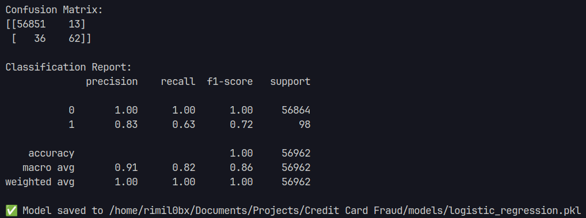
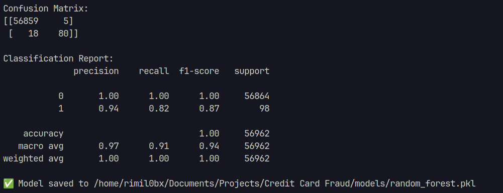
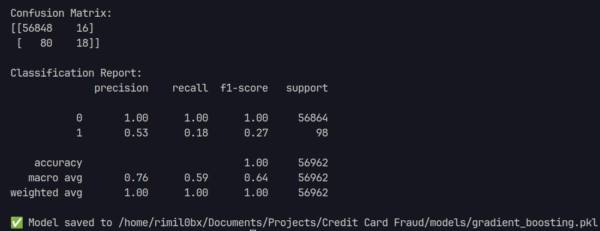

# 🛡️ Credit Card Fraud Detection

This project predicts whether a credit card transaction is **fraudulent or genuine** using machine learning models.  
We use the [Kaggle Credit Card Fraud Detection Dataset](https://www.kaggle.com/mlg-ulb/creditcardfraud), which contains transactions made by European cardholders in September 2013.  

---

## 📂 Project Structure

```
fraud-detection/
│
├── data/
│   └── creditcard.csv          # Dataset (downloaded from Kaggle)
│
├── preprocess.py               # Data loading & preprocessing
├── train.py                    # Model definitions & training
├── evaluate.py                 # Evaluation (confusion matrix, precision, recall, F1-score)
├── main.py                     # Entry point (connects all modules)
├── requirements.txt            # Dependencies
└── README.md                   # Project documentation
```

---

## ⚙️ Setup Instructions

### 1️⃣ Clone the repository
```bash
git clone <your-repo-url>
cd fraud-detection
```

### 2️⃣ Create and activate a virtual environment
- **Windows**
  ```bash
  python -m venv venv
  venv\Scripts\activate
  ```
- **Mac/Linux**
  ```bash
  python -m venv venv
  source venv/bin/activate
  ```

### 3️⃣ Install dependencies
```bash
pip install -r requirements.txt
```

### 4️⃣ Add dataset
Download the dataset from Kaggle and place `creditcard.csv` inside the `data/` folder.

### 5️⃣ Run the project
```bash
python main.py
```
## 🧾 Evaluation Metrics

### 🔹 Logistic Regression
Confusion Matrix:  


---

### 🔹 Random Forest
Confusion Matrix:  


---

### 🔹 Gradient Boosting
Confusion Matrix:  


---

## 📊 Models Used
We trained and compared three machine learning models:

1. **Logistic Regression** – interpretable baseline model  
2. **Random Forest** – ensemble model with good accuracy  
3. **XGBoost** – boosting-based classifier for handling imbalance  

---

## 🧾 Evaluation Metrics
We evaluate each model using:

- **Confusion Matrix**  
- **Precision**  
- **Recall**  
- **F1-Score**  

Example output for Logistic Regression:

```
=== Logistic Regression ===
Confusion Matrix:
 [[56863    31]
 [   54   104]]

              precision    recall  f1-score   support
           0     0.9991    0.9995    0.9993
           1     0.7704    0.6582    0.7102
```

- **Precision** → Of all transactions predicted as fraud, how many were actually fraud.  
- **Recall (Sensitivity)** → Of all actual fraud transactions, how many were correctly identified.  
- **F1-Score** → Harmonic mean of precision & recall (balances the two).  

---

## 📌 Requirements

See [requirements.txt](requirements.txt):

```
pandas
numpy
scikit-learn
matplotlib
seaborn
xgboost
```

Install them with:

```bash
pip install -r requirements.txt
```

---

## 📈 Future Improvements
- Handle **class imbalance** with SMOTE or undersampling/oversampling.  
- Add **deep learning models** (e.g., ANN, LSTM).  
- Deploy as an **API** (Flask/FastAPI) for real-time fraud detection.  
- Add **ROC & Precision-Recall curve plots** for visual comparison.  

---

## 👨‍💻 Author
- **Your Name**  
- Student, SRM Institute of Science and Technology  
- Passionate about AI/ML, Computer Vision, NLP, and Cybersecurity  

---

## 📜 License
This project is for educational purposes. Dataset source: Kaggle.  
